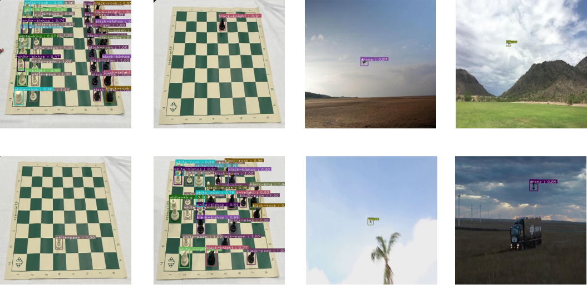

# Here is our pytorch implementation of the EfficientDet model to Detection and classification of small objects

Here is our pytorch implementation of the model described in the [Paper](https://openaccess.thecvf.com/content_CVPR_2020/papers/Tan_EfficientDet_Scalable_and_Efficient_Object_Detection_CVPR_2020_paper.pdf)
 EfficientDet: Scalable and Efficient Object Detection paper (Note: We also provide pre-trained weights, which you could see in [Drive](https://drive.google.com/drive/folders/1tyaq0c_YesoNot4c8n9M4uh89Njz7Sv_?usp=sharing)  at folder "train_weights"

## Datasets [Drive](https://drive.google.com/drive/folders/1tyaq0c_YesoNot4c8n9M4uh89Njz7Sv_?usp=sharing)

| Dataset          | #Images   | Image size (AVG) |    #Object     |    Object per image (AVG)  | Average object area ratio (%) |
|------------------|:---------:|:----------------:|:--------------:|:--------------------------:|:-----------------------------:|
| Chess            |    289    |     2048x1271    |     2870       | 9.9                        |           1%                  |
| MAV-VID          |    18952  |     1920x1080    |     20288      | 1.1                        |           1%                  |
| Full-UAV         |    2732   |     1100x900     |     3228       | 1.2                        |           1%                  |

## Experiments
Our Datasets divided  as shown in Table below
| Datasets           | Train set(#Image)|Train set(#Object)|Valid set(#Image)|Valid set(#Object)|Test set(#Image)|Test set(#Object)|Sum(#Image)|Sum(#Object)|
| :----------------: | :---------------:| :--------------: | :-------------: | :--------------: | :------------: | :-------------: | :-------: | :--------: |
| MAV-VID            |      12517       |      13842       |       4713      |        4717      |     1722       |      1729       |    18952  |     20288  |
| Full-UAV           |      1959        |      2426        |       502       |        514       |     271        |      288        |    2732   |     3228   |
| MAV-VID + Full-UAV |      14476       |      16268       |       5215      |        5231      |     1993       |      2017       |    21684  |     23516  |
| Chess              |      202         |      2108        |       58        |        286       |     29         |      376        |    289    |     2870   |

We trained our model by using Colab Pro . Below is mAP (mean average precision) for Chess and All UAVs (MAV-VID,Full-UAV and Combine of them) datasets under IoU=0.50

### [Chess](https://drive.google.com/drive/folders/1AcsElamKJ_dbW8jsGFGophF0pthIVxMV?usp=sharing) Experiments

|   Augmentation   |   Weight_download   | Epochs (stopped early) | Training Time(sec per epoch) | mAP          |
|-----------------------|:-------------- | :--------------------: | :--------------------------: | :----------- |
|   Baseline   |     [Weight](https://drive.google.com/drive/folders/1-MH4rrC0WU-QIc24EZ5wO9Q1-xwJgAdU?usp=sharing)     | 48    | 25     | 96\.71% |
|   Flip Horizontal     |     [Weight](https://drive.google.com/drive/folders/1-MH4rrC0WU-QIc24EZ5wO9Q1-xwJgAdU?usp=sharing)     | 45   | 32  | 95\.95%      |
|   Flip Vertical     |     [Weight](https://drive.google.com/drive/folders/1-MH4rrC0WU-QIc24EZ5wO9Q1-xwJgAdU?usp=sharing)  | 69      | 29      | 94\.41%      |
|   Flip Horizontal or Vertical      |     [Weight](https://drive.google.com/drive/folders/1-MH4rrC0WU-QIc24EZ5wO9Q1-xwJgAdU?usp=sharing)  | 63  | 29   | **97\.35%**  |
|   Flip Horizontal and Vertical      |     [Weight](https://drive.google.com/drive/folders/1-MH4rrC0WU-QIc24EZ5wO9Q1-xwJgAdU?usp=sharing) | 97   | 25    | 95\.16%      |
|   Hue     |     [Weight](https://drive.google.com/drive/folders/1-MH4rrC0WU-QIc24EZ5wO9Q1-xwJgAdU?usp=sharing) | 65    | 27   | 93\.79%      |
|   Saturation     |     [Weight](https://drive.google.com/drive/folders/1-MH4rrC0WU-QIc24EZ5wO9Q1-xwJgAdU?usp=sharing) | 95   | 25     | 95\.3%       |
|   Brightness     |     [Weight](https://drive.google.com/drive/folders/1-MH4rrC0WU-QIc24EZ5wO9Q1-xwJgAdU?usp=sharing)  | 65    | 27        | 89\.62%      |
|   Saturation and Brightness   |     [Weight](https://drive.google.com/drive/folders/1-MH4rrC0WU-QIc24EZ5wO9Q1-xwJgAdU?usp=sharing)  | 55    | 28   | 95\.94%      |
|   Saturation or Brightness     |     [Weight](https://drive.google.com/drive/folders/1-MH4rrC0WU-QIc24EZ5wO9Q1-xwJgAdU?usp=sharing) | 53   | 28   | 89\.46%      |
|   Grayscale     |     [Weight](https://drive.google.com/drive/folders/1-MH4rrC0WU-QIc24EZ5wO9Q1-xwJgAdU?usp=sharing)  | 35   | 25     | 95\.82%      |

### [Full-UAV](https://drive.google.com/drive/folders/1nqoAm8ZBanxAOQx1yrMDBKfRGr5R6xQX?usp=sharing) Experiments

|   Augmentation   |   Weight_download   | Epochs (stopped early) | Training Time(sec per epoch) | mAP          |
|-----------------------|:-------------- | :--------------------: | :--------------------------: | :----------- |
|   Baseline   |     [Weight](https://drive.google.com/drive/folders/1-MH4rrC0WU-QIc24EZ5wO9Q1-xwJgAdU?usp=sharing)    | 6  | 660  | 74\.26%      |
|   Flip Horizontal     |     [Weight](https://drive.google.com/drive/folders/1-MH4rrC0WU-QIc24EZ5wO9Q1-xwJgAdU?usp=sharing)    | 9  | 293    | **80\.0%**   |
|   Hue     |     [Weight](https://drive.google.com/drive/folders/1-MH4rrC0WU-QIc24EZ5wO9Q1-xwJgAdU?usp=sharing) | 8| 225         | 48\.94%      |
|   Saturation     |     [Weight](https://drive.google.com/drive/folders/1-MH4rrC0WU-QIc24EZ5wO9Q1-xwJgAdU?usp=sharing)   | 18  | 180      | 62\.0%       |
|   Brightness     |     [Weight](https://drive.google.com/drive/folders/1-MH4rrC0WU-QIc24EZ5wO9Q1-xwJgAdU?usp=sharing)  | 23   | 153      | 63\.74%      |
|   Saturation and Brightness   |     [Weight](https://drive.google.com/drive/folders/1-MH4rrC0WU-QIc24EZ5wO9Q1-xwJgAdU?usp=sharing)  | 14   | 184    | 64\.22%      |
|   Saturation or Brightness     |     [Weight](https://drive.google.com/drive/folders/1-MH4rrC0WU-QIc24EZ5wO9Q1-xwJgAdU?usp=sharing) | 12  | 195      | 59\.47%      |
|   Grayscale     |     [Weight](https://drive.google.com/drive/folders/1-MH4rrC0WU-QIc24EZ5wO9Q1-xwJgAdU?usp=sharing)  | 6    | 280   | 68\.29%      |

### [MAV-VID](https://drive.google.com/drive/folders/1HLFI6klK4_xEFbVgoSgM5RnitZQZhXOE?usp=sharing) Experiments

|   Augmentation   |   Weight_download   | Epochs (stopped early) | Training Time(sec per epoch) | mAP          |
|-----------------------|:-------------- | :--------------------: | :--------------------------: | :----------- |
|   Baseline   |     [Weight](https://drive.google.com/drive/folders/1-MH4rrC0WU-QIc24EZ5wO9Q1-xwJgAdU?usp=sharing)   | 3     | 6640    | 73\.14%     |
|   Flip Horizontal     |     [Weight](https://drive.google.com/drive/folders/1-MH4rrC0WU-QIc24EZ5wO9Q1-xwJgAdU?usp=sharing)   | 4 | 3900   | **82\.0%**  |
|   Saturation     |     [Weight](https://drive.google.com/drive/folders/1-MH4rrC0WU-QIc24EZ5wO9Q1-xwJgAdU?usp=sharing)  | 8      | 2925    | 79\.63%     |
|   Brightness     |     [Weight](https://drive.google.com/drive/folders/1-MH4rrC0WU-QIc24EZ5wO9Q1-xwJgAdU?usp=sharing)  | 8  | 2400  | 76\.38%     |
|   Grayscale     |     [Weight](https://drive.google.com/drive/folders/1-MH4rrC0WU-QIc24EZ5wO9Q1-xwJgAdU?usp=sharing)   | 4 | 3900   | 77\.15%     |

### [Combine MAV-VID + Full-UAV](https://drive.google.com/drive/folders/1T3vf8hjwTL1QjD1UT2WoSJEDQ7T4gyfG?usp=sharing) Experiments

|   Augmentation   |   Weight_download   | Epochs (stopped early) | Training Time(sec per epoch) | mAP          |
|-----------------------|:-------------- | :--------------------: | :--------------------------: | :----------- |
|   Baseline   |     [Weight](https://drive.google.com/drive/folders/1-MH4rrC0WU-QIc24EZ5wO9Q1-xwJgAdU?usp=sharing)   | 3    | 7220      | 77\.38%      |
|   Flip Horizontal     |     [Weight](https://drive.google.com/drive/folders/1-MH4rrC0WU-QIc24EZ5wO9Q1-xwJgAdU?usp=sharing)  | 7  | 377  | **83\.25%**  |
|   Saturation     |     [Weight](https://drive.google.com/drive/folders/1-MH4rrC0WU-QIc24EZ5wO9Q1-xwJgAdU?usp=sharing)  | 7    | 3394     | 79\.04%      |
|   Brightness     |     [Weight](https://drive.google.com/drive/folders/1-MH4rrC0WU-QIc24EZ5wO9Q1-xwJgAdU?usp=sharing)  | 7 | 3745   | 80\.65%      |
|   Grayscale     |     [Weight](https://drive.google.com/drive/folders/1-MH4rrC0WU-QIc24EZ5wO9Q1-xwJgAdU?usp=sharing)    | 7    | 3514  | 78\.19%      |
|   Saturation or Brightness     |     [Weight](https://drive.google.com/drive/folders/1-MH4rrC0WU-QIc24EZ5wO9Q1-xwJgAdU?usp=sharing) | 6   | 3590   | 82\.57%      |

## Results

Some predictions are shown below:

